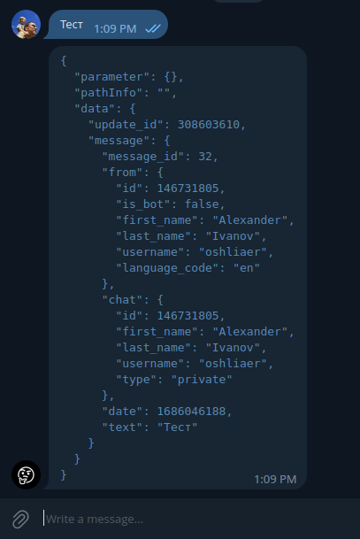

# Все еще просто эхо-бот

[@so_far_echo_bot] работает на [Apps Script] и просто возврщает в ответ то, что получил сам скрипт от Telegram по [Webhook].

Разрабатывается на [hedgehogsburrows/empty-google-apps-script-project].

Задать вопрос можно тут [t.me/googleappsscriptrc]

Задать вопрос по коду [gasru/so_far_echo_bot/issues]

[@so_far_echo_bot]: https://t.me/so_far_echo_bot
[Apps Script]: https://www.google.com/script/start/
[Webhook]: https://core.telegram.org/bots/api#setwebhook
[hedgehogsburrows/empty-google-apps-script-project]: https://github.com/hedgehogsburrows/empty-google-apps-script-project
[t.me/googleappsscriptrc]: https://t.me/googleappsscriptrc
[gasru/so_far_echo_bot/issues]: https://github.com/gasru/so_far_echo_bot/issues
